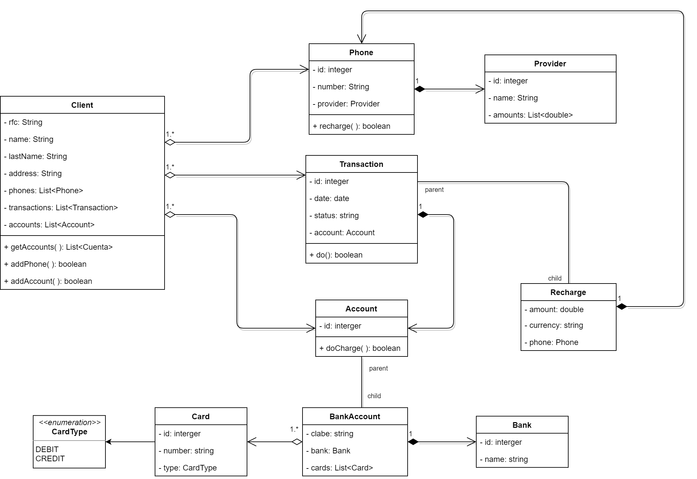

# **Explicación del ejercicio:**

*   Se necesita tener una funcionalidad a nivel de negocio, que permita al cliente de la aplicación bancaria gft wallet poder recargar tiempo aire a su celular.

Fase desde no se tiene nada hecho en la app:

*   Inicio desde el cliente selecciona de todas sus cuentas, cual quiere utilizar para hacer el retiro de la misma para la recarga.
*   El cliente debe seleccionar cual telefónica tiene como proveedor
*   El cliente debe seleccionar el monto y moneda de la recarga

Despues se le va a mostrar una pantalla de confirmación para decirle al cliente, como quedaría la operación que va a realizar:

## **Datos:**

*   cuenta seleccionada
*   telefónica seleccionada
*   monto y moneda de la recarga seleccionada
*   fecha de operación
*   número de celular del cliente

Al final habrá un botón que confirmara la recarga y al tener éxito en ella, se le devolverá los mismos datos al cliente agregando el folio de operación para que el banco pueda rastrear dicha operación, si el cliente tuvo algún problema.

## **¿Que se les pide?**

1. Diagrama uml bien hecho: nombre de campos de atributos en camel case, nombre de entidades o clases en upper camel case, tipo de cada campo y tipo de relación que tienen entre entidades o recursos
2. Número de servicios que se deben de diseñar y aplicar para que se contemple toda la funcionalidad de negocio antes descrita, que hará cada servicio y que se le va enviar de entrada y salida

### **Entidades:**

*   clients
    *   rfc #String
    *   name #String
    *   lastname #String
    *   address #String
    *   -> phones #agregacion
    *   -> accounts #agregacion
    *   _public_ Accounts[] getAccounts ( )
    *   _public_ boolean addPhone ( )
    *   _public_ boolean addAccount ( )
*   Phone
    *   id # integer
    *   number #String
    *   -> Provider # composicion
    *   _public_ boolean recharge ( )
*   Account
    *   id # integer
    *   -> transactions # agregacion
    *   _public_ boolean doCharge ( )
*   BankAccount &lt;- Account
    *   clabe # String
    *   _public_ boolean do ( )
    *   -> bank # composicion
*   Bank
    *   id # integer
    *   name #String
*   Provider
    *   id # integer
    *   name # String
*   Transaction
    *   id # integer
    *   fecha # date
    *   status # String
*   Recharge &lt;- Transaction
    *   amount # double
    *   currency # String
    *   _public_ boolean excecute ( )
    *   ->phone # composicion
    *   ->bankAccount # composicion

### 

### **Recursos**

*   Recurso: Banks
    *   URI: /banks/
        *   Verbo: GET
        *   Regresa: List&lt;Bank>
*   Recurso: Providers
    *   URI: /providers/
        *   Verbo: GET
        *   Regresa: List&lt;Provider>
*   Recurso: Accounts
    *   URI: /clients/{client-id}/accounts/
        *   verbo: POST
        *   Parametros: bank={bank-id}&clabe={clabe}
        *   Regresa: 201, Account
    *   URI: /clients/{client-id}/accounts/{account-id}/
        *   verbo: GET
        *   Regresa: 200, Account
    *   URI: /clients/{client-id}/accounts/
        *   verbo: GET
        *   Regresa: 200, List&lt;Account>
*   Recurso: Phones
    *   URI: /clients/{client-id}/phones/
        *   verbo: POST
        *   Parametros: number={number}&provider={provider-id}
        *   Regresa: 201, Phone
    *   URI: /clients/{client-id}/phones/
        *   Verbo: GET
        *   Regresa: 200, List&lt;Phone>
    *   URI: /clients/{client-id}/phones/{phone-id}/
        *   Verbo: GET
        *   Regresa: 200, Phone
*   Recurso: Recharges
    *   URI: /clients/{client-id}/recharges/{transaction-id}
        *   verbo: GET
        *   Regresa: 200, Recharges
    *   URI: /clients/{client-id}/recharges
        *   verbo: GET
        *   Regresa: 200, List&lt;Recharges>
    *   URI: /clients/{client-id}/recharges/
        *   Verbo: POST
        *   Parametros: account={account-id},amount={amount},currency={currency},phone={phone-id}
        *   Regresa: 201, Recharges

### **Diagrama**

